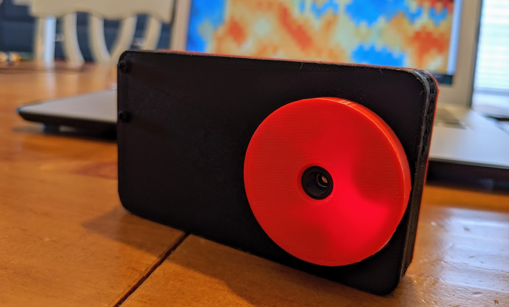
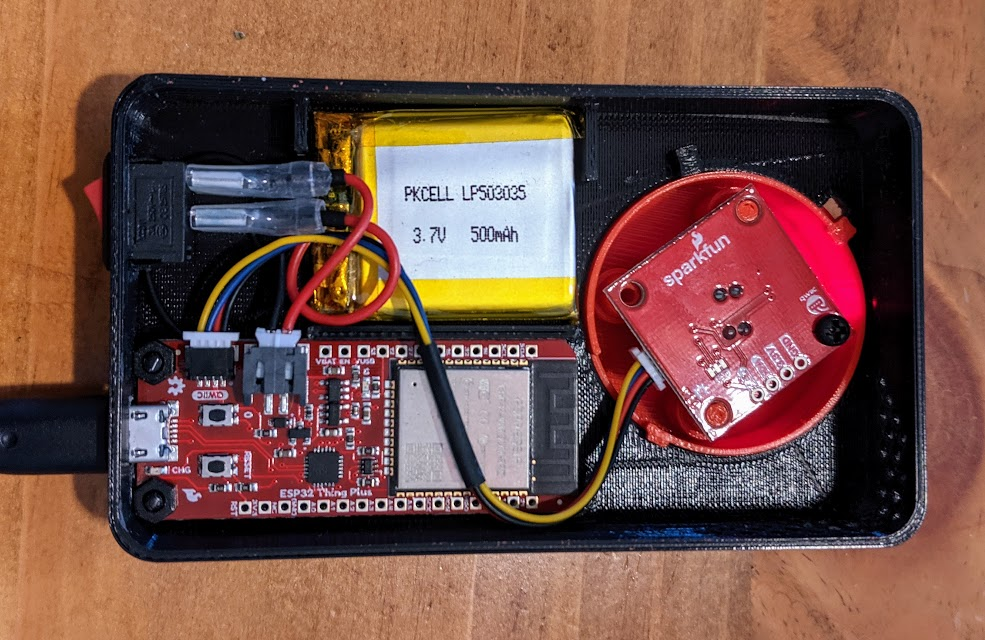

# ESP32 Thermal Camera

(MLX90640 thermal camera)[https://www.sparkfun.com/products/14844] connected to a (SparkFun Thing Plus - ESP32 WROOM)[https://www.sparkfun.com/products/14689]



## Components

- https://www.sparkfun.com/products/14689
- https://www.sparkfun.com/products/14844 or https://www.sparkfun.com/products/14843
- https://www.sparkfun.com/products/14427 x 2
- https://www.sparkfun.com/products/14532 (Optional)

**Total Cost: ~$115**

> NOTE: You'll also need a micro usb cable to power (and flash) the ESP32. I'm making the assumption that most people have one of these. If you want to make the project portable, you'll also need a battery bank.
 


## Mac Drivers

If using a Mac, you will need to install the following (drivers)[https://www.silabs.com/products/development-tools/software/usb-to-uart-bridge-vcp-drivers] to flash the ESP32. More information can be found (here)[https://github.com/espressif/arduino-esp32/issues/1084].

## Setup

1. Create an `env.h` file in the IRCameraWiFiServer folder and add your WiFi credentials
   ```
   static const char* wifi_ssid = "YOUR_WIFI_SSID";
   static const char* wifi_pw = "YOU_WIFI_PW";
   ```
2. Connect your SparkFun Thing Plus - ESP32 WROOM using this (guide)[https://learn.sparkfun.com/tutorials/esp32-thing-plus-hookup-guide] 
3. Make sure to select **Adafruit ESP32 Feather** in the Arduino IDE
4. Install the following libraries
   - SparkFun_Micro_OLED_Breakout
   - WebSocketsServer
5. Flash the code on your device
6. Navigate to the IP address from the serial monitor



### Notes

In retrospect, the power switch should put the device into a low power mode instead of disconnecting the battery. Keeping the battery connected would allow for charging while the device is 'off'. Right now, it must be turned on to charge the battery.

Additional screw mounts for the enclosure would help to ensure the back stays on. Right now it's easy for the back panel to pop off.

There should be enough room for a micro OLED or LCD panel. 3D printing a support layer would help keep the battery in place and provice something to mount the screen to.

## Message Queue

When using both cores of the ESP32, a message queue must be used to send data between the cores. Sharing variables in the global scope will lead to memory issues and will cause problems.


## Resources

- https://github.com/melexis/mlx90640-library
- https://github.com/sparkfun/SparkFun_MLX90640_Arduino_Example
- http://minifycode.com/html-minifier/
- https://techtutorialsx.com/2017/11/01/esp32-arduino-websocket-client/
- http://www.iotsharing.com/2017/06/arduino-esp32-freertos-how-to-use-message-queue.html
- http://www.iotsharing.com/2017/05/how-to-turn-esp32-into-web-server.html
- http://www.iotsharing.com/2017/06/arduino-esp32-freertos-how-to-use-task-param-task-priority-task-handle.html
- https://medium.com/@mudassar.tamboli/esp32-ov7670-websocket-video-camera-26c35aedcc64
